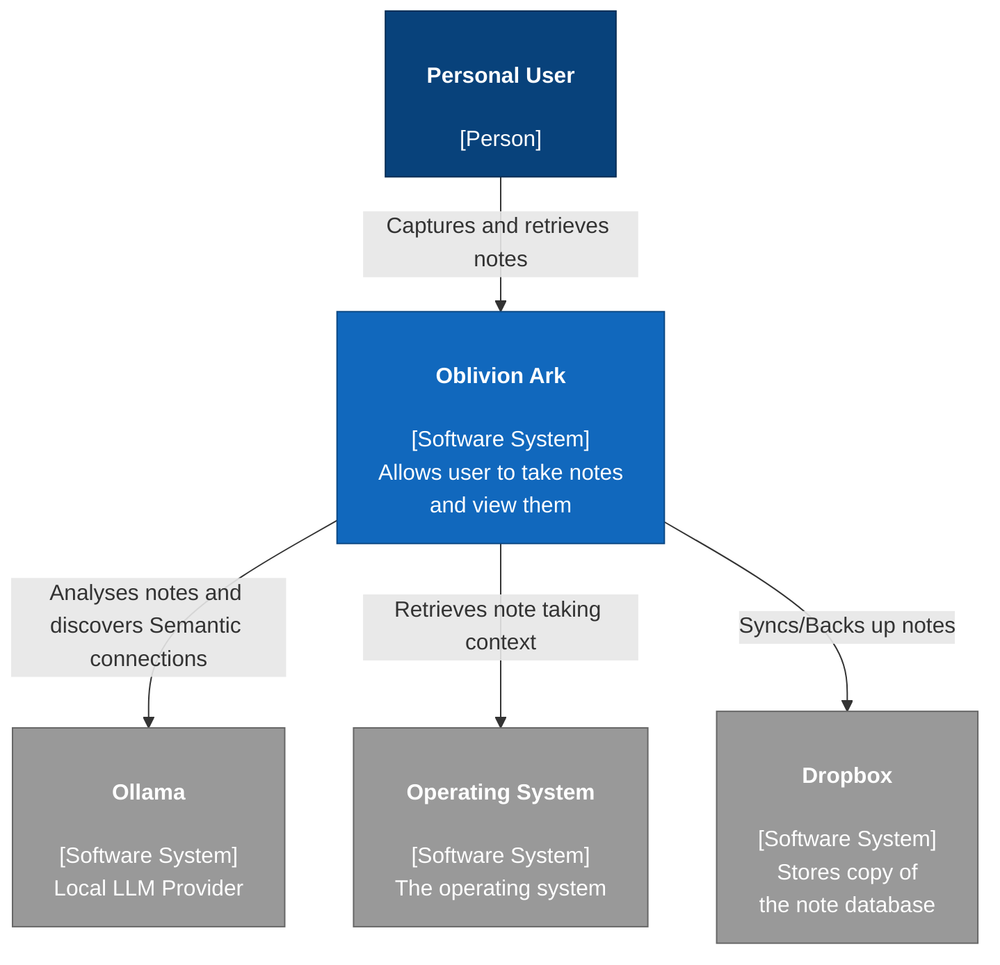
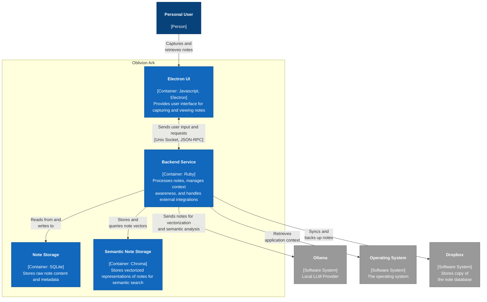

# Oblivion Ark Project Overview

Oblivion Ark is a personal note-taking application.
Primary features are frictionless capturing of quick notes while working at the
computer and automatic AI-powered interconnections to other semantically or
contextually related notes.

## Architecture

### System Context

<!-- markdownlint-disable MD013 -->

<!-- markdownlint-enable MD013 -->

### Containers

<!-- markdownlint-disable MD013 -->

<!-- markdownlint-enable MD013 -->
